<picture>
  <source media="(prefers-color-scheme: dark)" srcset="assets/hero-dark.svg">
  <source media="(prefers-color-scheme: light)" srcset="assets/hero-light.svg">
  
</picture>

 

I'm a full-stack engineer from Denmark, now doing my master's in computer
science (AI) in San Francisco. I like systems that run from one end to the
other: a model, the service that serves it, and the app someone actually taps.
Lately that means AI agents, MCP servers and native Swift apps.

 

<picture>
  <source media="(max-width: 767px) and (prefers-color-scheme: dark)" srcset="assets/h-now-dark-phone.svg">
  <source media="(max-width: 767px) and (prefers-color-scheme: light)" srcset="assets/h-now-light-phone.svg">
  <source media="(prefers-color-scheme: dark)" srcset="assets/h-now-dark.svg">
  <source media="(prefers-color-scheme: light)" srcset="assets/h-now-light.svg">
  
</picture>

- **Building an MCP server for SnapLogic's SLIM platform**, a USF industry project with SnapLogic, fall 2026
- **Just open-sourced [claude-pet](https://github.com/Dressi123/claude-pet)**, a desktop fox that acts out whatever Claude Code is doing, and **[second-brain-skill](https://github.com/Dressi123/second-brain-skill)**, the Claude Code skill and MCP servers behind my own second brain
- **Shipping Marble**, an iOS app that turns your camera roll into a travel globe
- **Just wrapped** a software engineering internship at **Handshake AI**, taking an LLM-judge backtesting and audit system from architecture doc to production
- **NextGen AI Fellow** at **Notable Capital**, one of 29 selected from 7,000+ applicants

 

<picture>
  <source media="(max-width: 767px) and (prefers-color-scheme: dark)" srcset="assets/h-work-dark-phone.svg">
  <source media="(max-width: 767px) and (prefers-color-scheme: light)" srcset="assets/h-work-light-phone.svg">
  <source media="(prefers-color-scheme: dark)" srcset="assets/h-work-dark.svg">
  <source media="(prefers-color-scheme: light)" srcset="assets/h-work-light.svg">
  
</picture>

<!-- Each card appears twice: a half-width copy for screens 768px and up, and a
     full-width copy for phones. The copy not meant for the current screen swaps
     to a blank placeholder (see assets/make_profile.py). Keep the two copies of a
     card touching, with a single space between cards. -->

<a href="https://github.com/Dressi123/second-brain-skill"><picture><source media="(min-width: 768px) and (prefers-color-scheme: dark)" srcset="assets/card-second-brain-dark.svg"><source media="(min-width: 768px) and (prefers-color-scheme: light)" srcset="assets/card-second-brain-light.svg"></picture></a><a href="https://github.com/Dressi123/second-brain-skill"><picture><source media="(min-width: 768px)" srcset="assets/blank-dot.svg"><source media="(prefers-color-scheme: light)" srcset="assets/card-second-brain-light.svg"></picture></a>
<picture><source media="(min-width: 768px) and (prefers-color-scheme: dark)" srcset="assets/card-marble-dark.svg"><source media="(min-width: 768px) and (prefers-color-scheme: light)" srcset="assets/card-marble-light.svg"></picture><picture><source media="(min-width: 768px)" srcset="assets/blank-dot.svg"><source media="(prefers-color-scheme: light)" srcset="assets/card-marble-light.svg"></picture>
<a href="https://github.com/Dressi123/claude-pet"><picture><source media="(min-width: 768px) and (prefers-color-scheme: dark)" srcset="assets/card-claude-pet-dark.svg"><source media="(min-width: 768px) and (prefers-color-scheme: light)" srcset="assets/card-claude-pet-light.svg"></picture></a><a href="https://github.com/Dressi123/claude-pet"><picture><source media="(min-width: 768px)" srcset="assets/blank-dot.svg"><source media="(prefers-color-scheme: light)" srcset="assets/card-claude-pet-light.svg"></picture></a>
<a href="https://drive.google.com/file/d/1AUVve-4bVPUTJg2TUHy7zaDd6EXWRGFo/view?usp=sharing"><picture><source media="(min-width: 768px) and (prefers-color-scheme: dark)" srcset="assets/card-ais-thesis-dark.svg"><source media="(min-width: 768px) and (prefers-color-scheme: light)" srcset="assets/card-ais-thesis-light.svg"></picture></a><a href="https://drive.google.com/file/d/1AUVve-4bVPUTJg2TUHy7zaDd6EXWRGFo/view?usp=sharing"><picture><source media="(min-width: 768px)" srcset="assets/blank-dot.svg"><source media="(prefers-color-scheme: light)" srcset="assets/card-ais-thesis-light.svg"></picture></a>
<a href="https://github.com/Dressi123/FakeOut"><picture><source media="(min-width: 768px) and (prefers-color-scheme: dark)" srcset="assets/card-fakeout-dark.svg"><source media="(min-width: 768px) and (prefers-color-scheme: light)" srcset="assets/card-fakeout-light.svg"></picture></a><a href="https://github.com/Dressi123/FakeOut"><picture><source media="(min-width: 768px)" srcset="assets/blank-dot.svg"><source media="(prefers-color-scheme: light)" srcset="assets/card-fakeout-light.svg"></picture></a>
<a href="https://github.com/Dressi123/cf_ai_learning_companion"><picture><source media="(min-width: 768px) and (prefers-color-scheme: dark)" srcset="assets/card-learning-companion-dark.svg"><source media="(min-width: 768px) and (prefers-color-scheme: light)" srcset="assets/card-learning-companion-light.svg"></picture></a><a href="https://github.com/Dressi123/cf_ai_learning_companion"><picture><source media="(min-width: 768px)" srcset="assets/blank-dot.svg"><source media="(prefers-color-scheme: light)" srcset="assets/card-learning-companion-light.svg"></picture></a>

 

<picture>
  <source media="(max-width: 767px) and (prefers-color-scheme: dark)" srcset="assets/h-journey-dark-phone.svg">
  <source media="(max-width: 767px) and (prefers-color-scheme: light)" srcset="assets/h-journey-light-phone.svg">
  <source media="(prefers-color-scheme: dark)" srcset="assets/h-journey-dark.svg">
  <source media="(prefers-color-scheme: light)" srcset="assets/h-journey-light.svg">
  
</picture>

<picture>
  <source media="(prefers-color-scheme: dark)" srcset="assets/journey-dark.svg">
  <source media="(prefers-color-scheme: light)" srcset="assets/journey-light.svg">
  
</picture>

 

<picture>
  <source media="(max-width: 767px) and (prefers-color-scheme: dark)" srcset="assets/h-toolbox-dark-phone.svg">
  <source media="(max-width: 767px) and (prefers-color-scheme: light)" srcset="assets/h-toolbox-light-phone.svg">
  <source media="(prefers-color-scheme: dark)" srcset="assets/h-toolbox-dark.svg">
  <source media="(prefers-color-scheme: light)" srcset="assets/h-toolbox-light.svg">
  
</picture>

<picture>
  <source media="(prefers-color-scheme: dark)" srcset="assets/toolbox-dark.svg">
  <source media="(prefers-color-scheme: light)" srcset="assets/toolbox-light.svg">
  
</picture>

 

  Every image on this page is drawn by <a href="assets/make_profile.py"><code>assets/make_profile.py</code></a>. No image editor was used, just Python writing SVG.

